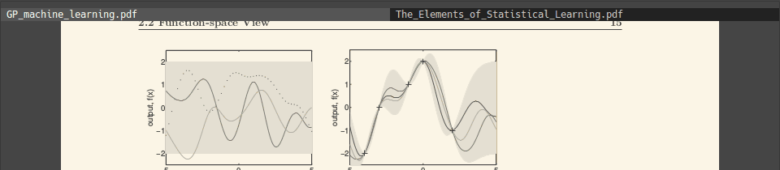

dmenu - dynamic menu
====================
dmenu is an efficient dynamic menu for X.

My config for [dmenu](https://git.suckless.org/dmenu)

Includes: Hack font, fuzzy search and case insensitive search patches.

I use it within tabbed. `dmenu` pops up with `Ctrl+grave`. 

