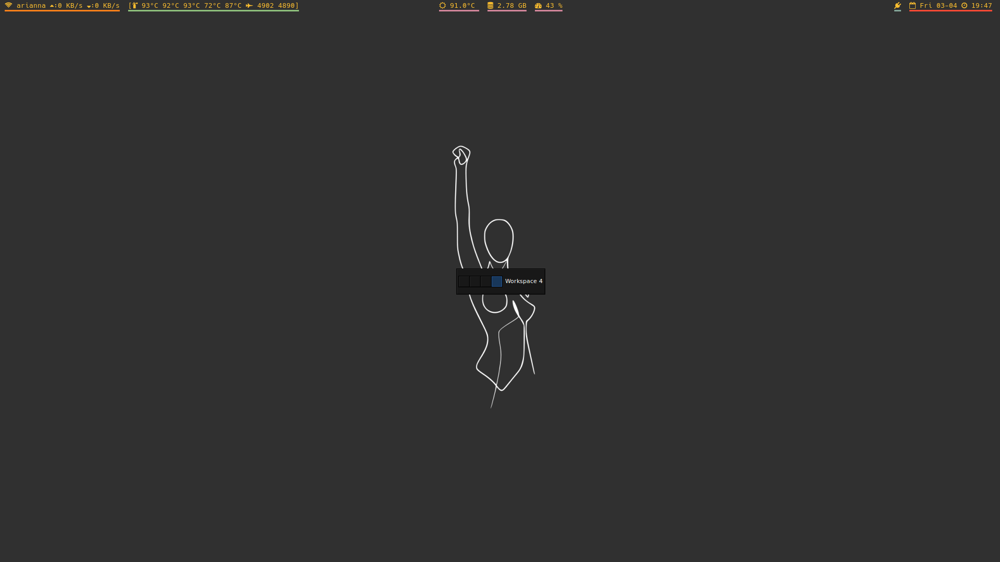

# dotfiles
My dotfiles, personal scripts (`bin`) and some custom build (`0_BUILD`)
Dotfiles are managed with GNU stow.
#
[albert](https://github.com/albertlauncher/albert), [polybar](https://github.com/jaagr/polybar), [st](https://github.com/emanuelealiverti/st) running zsh, [zathura](https://pwmt.org/projects/zathura/) running inside [tabbed](https://github.com/emanuelealiverti/tabbed).

#
tmux, vim, ncmcpp running spotify

