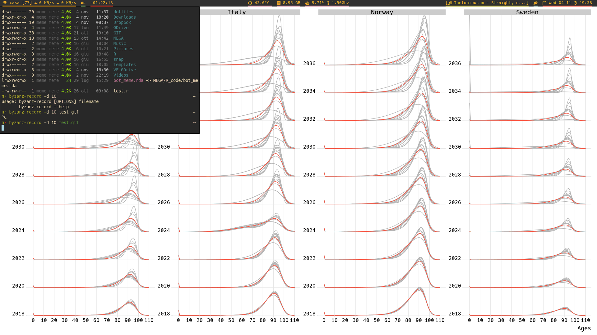

# dotfiles
For vim, zsh, polybar, etc. Managed with [GNU stow](http://www.gnu.org/software/stow/). Some functions (such as [`k`](https://github.com/supercrabtree/k)) are defined in [my bin files](https://github.com/emanuelealiverti/bin)

#
In the preview: [albert](https://github.com/albertlauncher/albert), [polybar](https://github.com/jaagr/polybar), [st](https://github.com/emanuelealiverti/st) running zsh, [zathura](https://pwmt.org/projects/zathura/) running inside [tabbed](https://github.com/emanuelealiverti/tabbed).
